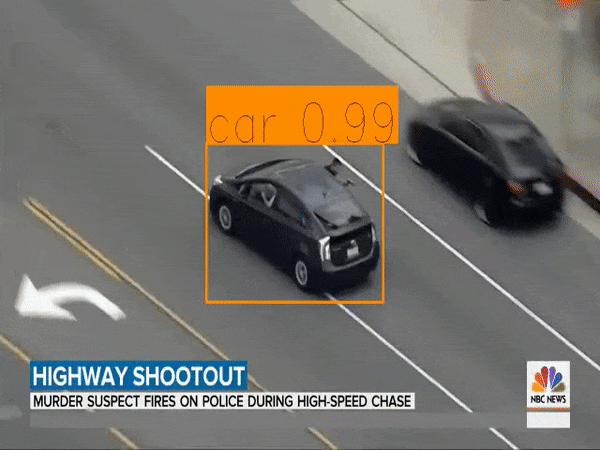

# object-tracking




I have prepared two solutions. One using pretrained model (YOLO) and another one I trained myself (Faster R-CNN).  I trained Faster R-CNN for three classes person, football and car. The code of Faster R-CNN code is in `custom_trained` folder. There are two jupyter notebook files. I trained the model in Google Colab they can be accessed in Google Colab here :                 
https://colab.research.google.com/drive/1lQhFpWktj594mOQafFtfAdI4jWucAgEx and https://colab.research.google.com/drive/1dfcK8hDPEGSVwHSTmH4-U8hn9pl-aD4u

In first jupyter notebook data preprocessing is done. I used `Open Image Dataset V5` here is the link to dataset: https://storage.googleapis.com/openimages/web/download.html

In second jupyter notebook Faster R-CNN model is trained. The weights of the trained model is downloaded and then implemented to detect objects (person, football, car) in a video. To process a video I used Opencv. Video is read frame by frame and objects are detected in each frame and then rectangle boxes are drawn around the objects and the modified frames are written back.


I used YOLOv3 pretrained network to track objects in a video. In code file you have to put your video file path.

Download YOLOv3 weights from YOLO website:  https://pjreddie.com/darknet/yolo/

or using following command:- 

```bash
wget https://pjreddie.com/media/files/yolov3.weights
```

After downloading put the weight file in model_data folder. Now run following command to convert these weights for Keras model.

```bash
python convert.py model_data/yolov3.cfg model_data/yolov3.weights model_data/yolo_weights.h5
```

Now we have everything to run the model. 

Requirements:-

1. Keras
2. Tensorflow
3. PIL
4. Matplotlib
5. Numpy
6. Opencv


Use good GPU system to avoid video lagging. Nvidia GTX 1050ti would be good.

After doing everything run it by:

`python yolo_object_detection.py -v <video path>`

